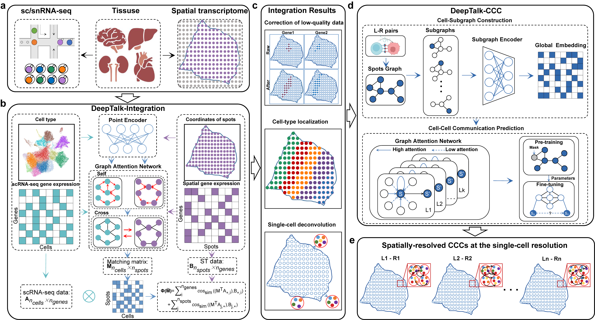

.. DeepTalk documentation master file, created by
   sphinx-quickstart on Sat Feb 20 12:08:49 2023.
   You can adapt this file completely to your liking, but it should at least
   contain the root `toctree` directive.

DeepTalk 
==========================
Deciphering cell-cell communication from spatially resolved transcriptomic data at single-cell resolution with subgraph-based attentional graph neural network

.. toctree::
   :maxdepth: 1
   :hidden:
   
   installation
   tutorials
